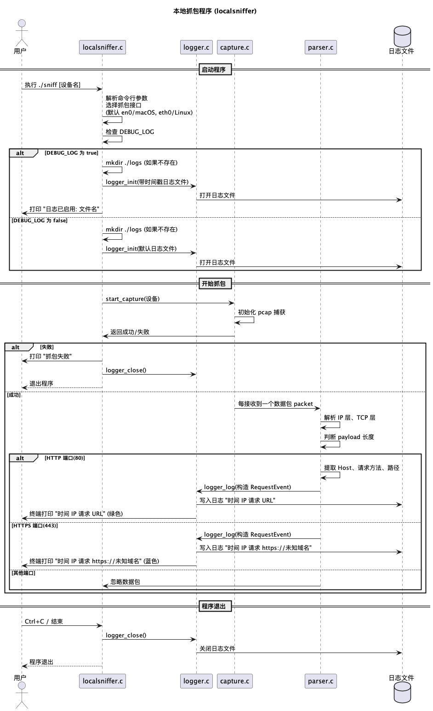
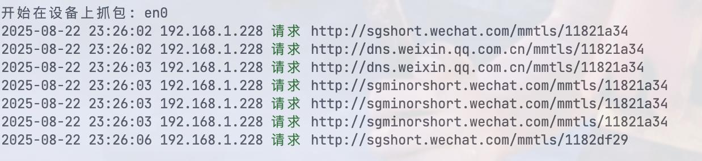

# 本地网络抓包与日志系统 (LocalSniffer)

## 简介

本项目是一个基于 Unix 系统的本地网络抓包与请求日志工具，用于实时监控网络中 HTTP 和 HTTPS 请求。它能够列出抓取到的每个设备的请求信息，并将日志写入文件，同时在终端实时显示。适用于 IT 管理、网络调试和安全审计场景。

---

## 功能

* 自动识别网络接口（macOS: en0，Linux: eth0）或自定义接口
* 实时抓取 HTTP/HTTPS 请求
* 自动解析 IP、端口、Host 和路径信息
* 日志写入文件，按时间戳命名
* 终端彩色输出，区分 HTTP/HTTPS
* 支持 DEBUG 模式记录详细日志
* 日志目录自动创建

---

## 使用方法

### 构建

```bash
make
```

### 运行

```bash
sudo ./sniff 
```

* 日志默认写入 `./logs/default.log`
* DEBUG 模式会按时间戳生成日志文件：

  ```c
  ./logs/2025-08-22-21-45-00.log
  ```

### 输出示例

```text
2025-08-22 21:45:00 192.168.1.10 请求 http://example.com/index.html
2025-08-22 21:45:01 192.168.1.12 请求 https://unknown.domain
```

* HTTP 请求显示为绿色，HTTPS 请求显示为蓝色

---

## 技术信息

### 数据流概述

1. **初始化**

   * 解析命令行参数，选择抓包网络接口
   * 创建日志目录
   * 初始化日志文件（DEBUG 模式或默认日志）

2. **抓包层（Capture）**

   * 使用 `libpcap` 抓取指定接口的网络包
   * 每收到一个数据包触发回调

3. **解析层（Parser）**

   * 分析 IP 层获取源 IP、目标 IP
   * 分析 TCP 层获取源端口、目标端口
   * 判断是否为 HTTP (port 80) 或 HTTPS (port 443)
   * 提取 Host 和 URL 路径信息

4. **日志层（Logger）**

   * 构造 `RequestEvent` 结构体
   * 打印到终端（彩色区分协议）
   * 写入日志文件
   * 定时刷新，保证数据实时性

### 系统流程图

```text
+-----------------+
|    Main         |
| 初始化 & 参数解析|
+--------+--------+
         |
         v
+-----------------+
|    Capture      |
| 抓包 libpcap    |
+--------+--------+
         |
         v
+-----------------+
|    Parser       |
| IP/TCP解析      |
| 判断协议 & URL  |
+--------+--------+
         |
         v
+-----------------+
|    Logger       |
| 打印终端 & 写日志|
+-----------------+
```

### 系统流程图



### 数学公式说明

抓包和日志处理过程中可以使用简单的统计模型描述数据量和速率：

1. **平均请求速率**

$$
R = \frac{N}{T}
$$

* $R$ ：每秒请求数 (requests/sec)
* $N$ ：在时间段 $T$ 内抓到的请求总数
* $T$ ：抓包总时长（秒）

2. **日志文件大小估算**

$$
S = N \cdot L
$$

* $S$ ：日志总大小 (bytes)
* $N$ ：请求总数
* $L$ ：每条日志的平均长度 (bytes)

3. **实时刷新延迟**

$$
\Delta t \approx \frac{B}{R}
$$

* $\Delta t$ ：终端显示延迟
* $B$ ：输出缓冲区大小
* $R$ ：请求速率

---

### 输出示例
终端运行效果:



---

## 系统要求

* Unix 系统 (Linux/macOS)
* GCC 或兼容编译器
* libpcap 库
* root 权限抓取网卡数据包

---

## 文件结构

```text
.
├── include
│   ├── capture.h
│   ├── logger.h
│   ├── parser.h
│   └── utilities.h
├── src
│   ├── capture.c
│   ├── logger.c
│   ├── parser.c
│   └── utilities.c
├── localsniffer.c
├── Makefile
└── logs
```

---

## 安全与注意事项

* 需要 root 权限访问网络接口
* HTTPS 请求无法解析路径，默认记录 `未知域名`
* 日志文件可能包含敏感信息，请妥善管理

---


## 法律合规与免责声明

* 本工具仅供 **授权的渗透测试、安全研究、教育学习** 使用
* 未经授权使用本工具对目标进行扫描，可能违反相关法律法规
* 使用者须自行承担一切法律与道德责任
* 作者不对任何非法使用行为负责

---


## 🌟 开源项目赞助计划

### 用捐赠助力发展

感谢您使用本项目！您的支持是开源持续发展的核心动力。  
每一份捐赠都将直接用于：  
✅ 服务器与基础设施维护（魔法城堡的维修费哟~）  
✅ 新功能开发与版本迭代（魔法技能树要升级哒~）  
✅ 文档优化与社区建设（魔法图书馆要扩建呀~）

点滴支持皆能汇聚成海，让我们共同打造更强大的开源工具！  
（小仙子们在向你比心哟~）

---

### 🌐 全球捐赠通道

#### 国内用户

<div align="center" style="margin: 40px 0">

<div align="center">
<table>
<tr>
<td align="center" width="300">

<br />
<strong>🔵 支付宝</strong>（小企鹅在收金币哟~）
</td>
<td align="center" width="300">

<br />
<strong>🟢 微信支付</strong>（小绿龙在收金币哟~）
</td>
</tr>
</table>
</div>
</div>

#### 国际用户

<div align="center" style="margin: 40px 0">
  <a href="https://qr.alipay.com/fkx19369scgxdrkv8mxso92" target="_blank">
    
  </a>
  
  <a href="https://ko-fi.com/F1F5VCZJU" target="_blank">
    
  </a>
  
  <a href="https://www.paypal.com/paypalme/ctkqiang" target="_blank">
    
  </a>
  
  <a href="https://donate.stripe.com/00gg2nefu6TK1LqeUY" target="_blank">
    
  </a>
</div>

---

### 📌 开发者社交图谱

#### 技术交流

<div align="center" style="margin: 20px 0">
  <a href="https://github.com/ctkqiang" target="_blank">
    
  </a>
  
  <a href="https://stackoverflow.com/users/10758321/%e9%92%9f%e6%99%ba%e5%bc%ba" target="_blank">
    
  </a>
  
  <a href="https://www.linkedin.com/in/ctkqiang/" target="_blank">
    
  </a>
</div>

#### 社交互动

<div align="center" style="margin: 20px 0">
  <a href="https://www.instagram.com/ctkqiang" target="_blank">
    
  </a>
  
  <a href="https://twitch.tv/ctkqiang" target="_blank">
    
  </a>
  
  <a href="https://github.com/ctkqiang/ctkqiang/blob/main/assets/IMG_9245.JPG?raw=true" target="_blank">
    
  </a>
</div>

---

🙌 感谢您成为开源社区的重要一员！  
💬 捐赠后欢迎通过社交平台与我联系，您的名字将出现在项目致谢列表！